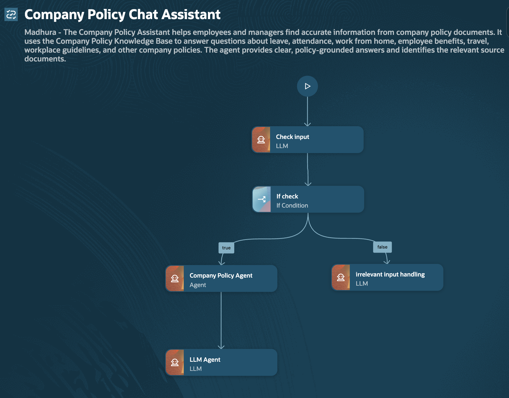
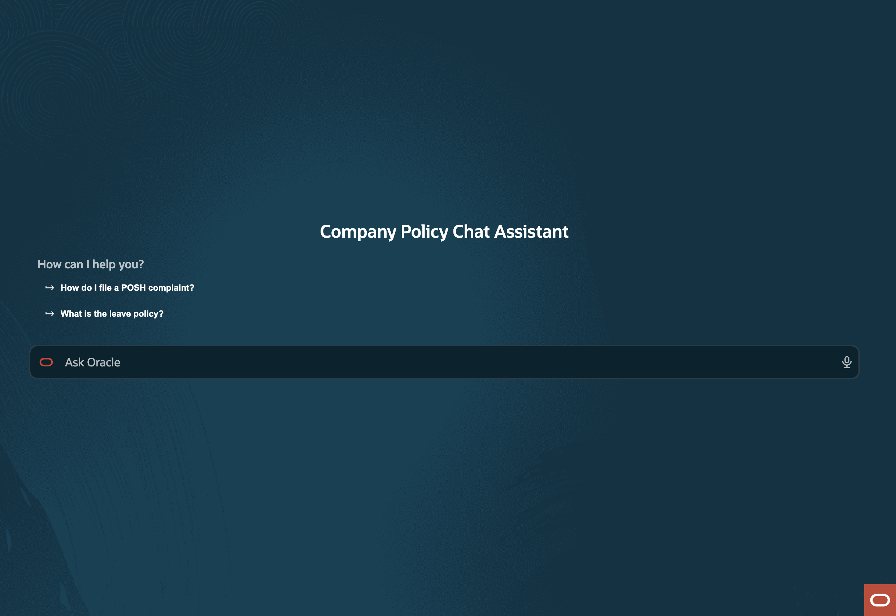
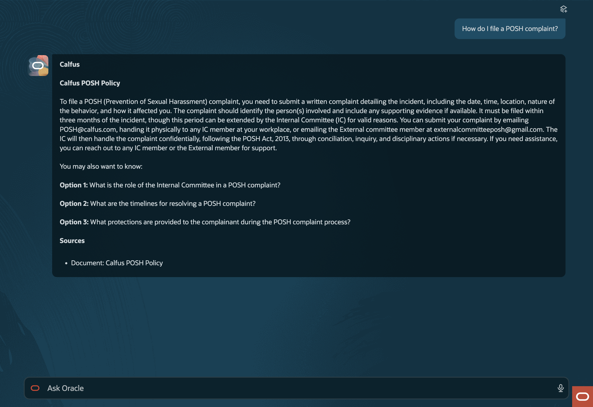
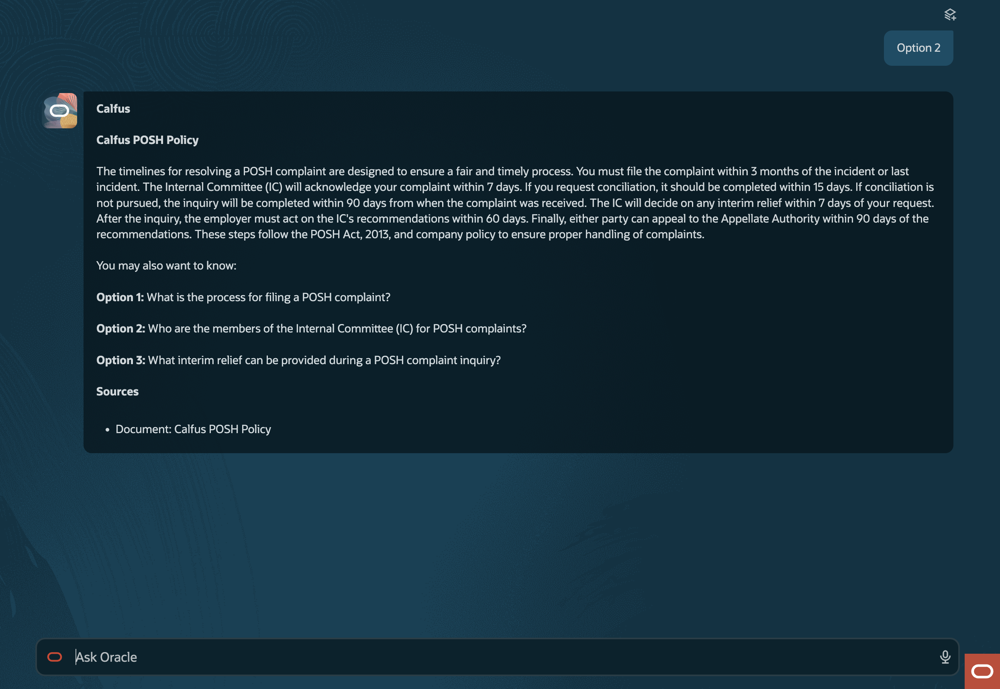
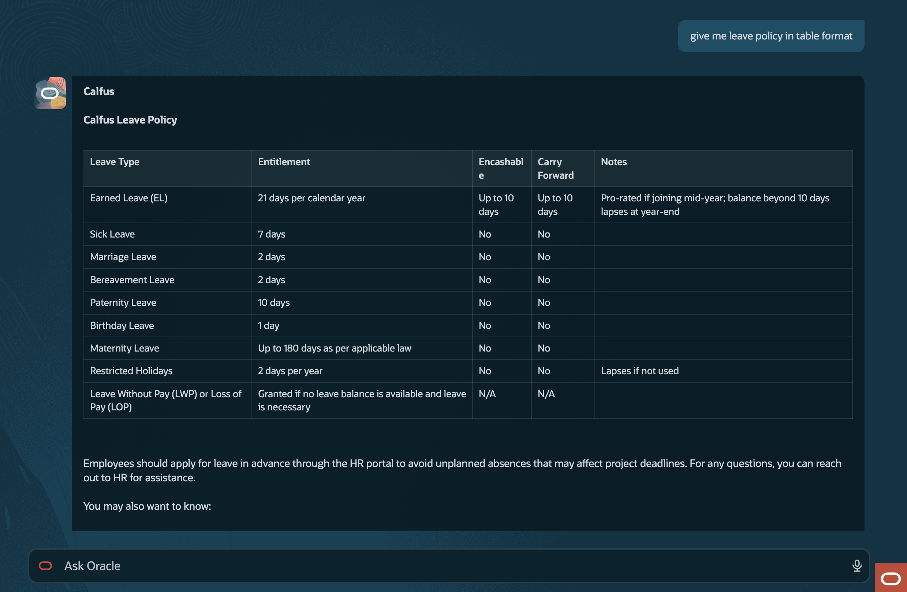
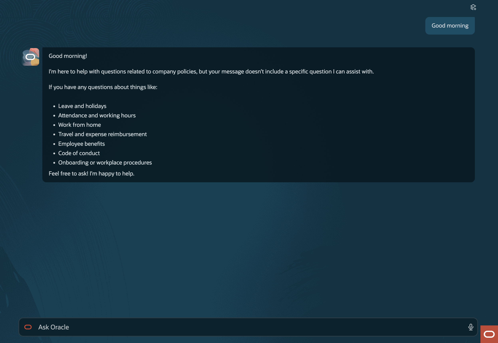

# Company Policy Assistant — Chat-Based Agent

A conversational AI assistant built in **Oracle AI Agent Studio** that lets employees ask company
policy questions in plain English across a multi-turn chat, and returns answers grounded in — and
cited to — an internal library of policy PDFs.

---

## Problem Statement

> Companies deal with large volumes of internal documents — HR policies, product manuals,
> onboarding guides, SOPs — and employees waste time hunting for answers buried in PDFs.
> Build an AI assistant that lets users ask questions in plain English and get accurate,
> cited answers from a document library.

Company policies live as dozens of PDFs on an HRMS portal. An employee wondering *"How many days
do I have to submit a travel claim?"* has to guess which of 16 documents applies, open a 40-page
PDF, `Ctrl+F` for the right clause, and interpret dense policy language alone — or raise an HR
ticket.

A naive chatbot makes this worse: a confidently hallucinated policy answer is more damaging than
no answer, because employees act on it. The assistant has to be **verifiable**, not just fluent.

---

## Solution

| | |
|---|---|
| **Platform** | Oracle AI Agent Studio (Fusion HCM) |
| **Workflow** | `COMPANY_POLICY_CHAT_ASSISTANT` — `data_pipeline`, 7 nodes |
| **Agent** | 1 published `WORKER` agent |
| **Document tool** | 1 `DOCUMENT` tool, 16 policy PDFs |
| **Model** | `ORA_MODEL_CONFIG_PREMIUM_OPEN_AI_GPT_4_1_MINI` |
| **Trigger** | `REST` |
| **Status** | `PUBLISHED` |

A single reusable agent answers every policy question, with a relevance gate in front of it and a
formatting layer behind it.

| Property | Value |
|---|---|
| Agent code | `COMPANY_POLICY_ASSISTANT` |
| Type | `WORKER` — performs the task itself, no sub-agents |
| Reusable | `true` — can be invoked from any workflow |
| Max interactions | `5` — tool-call budget per turn |
| Input | `question` (string) |
| Tool attached | `COMPANY_POLICY_KNOWLEDGE_BASE` |

The agent is constrained by a JSON Schema, so the workflow receives predictable data rather than
free text:

```jsonc
{
  "answer": "string",
  "sources": [
    {
      "documentName": "Travel Policy",              // required on every entry
      "section": "1.7 — Reimbursement Process",     // only when explicitly present
      "page": "12", "heading": "...", "chapter": "...",
      "table": "...", "clause": "...", "appendix": "...",
      "sourceIdentifier": "..."
    }
  ],
  "follow_up_options": ["...", "...", "..."]        // exactly 3
}
```

Because `sources` is a required field with `documentName` required on every entry, **citations are
structurally guaranteed** rather than left to the model's discretion.

---

## The Workflow

Every time the employee sends a message, the entire workflow runs once from start to end, using
the full conversation history to understand context.

```
                    ┌───────────┐
                    │   START   │
                    └─────┬─────┘
                          │  user message + chat history
                          ▼
              ┌───────────────────────┐
              │      CHECK_INPUT      │  LLM
              │  • what is the user   │  → { isRelevant,
              │    really asking?     │      resolvedQuestion }
              │  • is it in scope?    │
              └───────────┬───────────┘
                          ▼
              ┌───────────────────────┐
              │       IF_CHECK        │  CONDITION
              │   isRelevant == true? │
              └───┬───────────────┬───┘
           true   │               │   false
                  ▼               ▼
   ┌───────────────────────┐  ┌──────────────────────────┐
   │ COMPANY_POLICY_AGENT  │  │ IRRELEVANT_INPUT_HANDLING│  LLM
   │        AGENT          │  │   friendly out-of-scope  │
   │                       │  │   redirect + topic list  │
   │  ┌─────────────────┐  │  └────────────┬─────────────┘
   │  │ Company Policy  │  │               │
   │  │ Knowledge Base  │  │               │
   │  └─────────────────┘  │               │
   │                       │               │
   │  → answer + sources   │               │
   │    + follow_up_options│               │
   └───────────┬───────────┘               │
               ▼                           │
   ┌───────────────────────┐               │
   │       LLM_AGENT       │  LLM          │
   │  presentation only:   │               │
   │  • branding           │               │
   │  • answer formatting  │               │
   │  • Option 1/2/3 menu  │               │
   │  • Sources block      │               │
   └───────────┬───────────┘               │
               └────────────┬──────────────┘
                            ▼
                      ┌───────────┐
                      │    END    │
                      └───────────┘
```

### Step 1 — Check Input *(router)*

An LLM node reads the current message and the chat history, and returns validated JSON:

```json
{ "isRelevant": true, "resolvedQuestion": "What is the leave policy?" }
```

Both fields are required and `additionalProperties` is `false`, so the node cannot drift into
returning prose the next node would fail to parse.

**Determining the question.** For a normal question, `resolvedQuestion` is the user's input
verbatim. A hard rule forbids chat history from overriding it — this prevents the common failure
where a short question like *"POSH policy?"* is silently rewritten into a topic from an earlier
turn. History is consulted in exactly one case: when the message is exactly `Option 1`/`Option 2`/
`Option 3`/`1`/`2`/`3`, the node looks back at the **most recent** assistant reply containing
*"You may also want to know:"* and expands the selection into the full question text. Older option
lists are explicitly out of bounds.

**Determining relevance.** `isRelevant` is `true` for company and HR policy, leave, attendance,
benefits, travel, expenses, workplace procedures, and company rules; `false` otherwise. The node
never answers the question — it only classifies and resolves.

### Step 2 — If Check *(scope gate)*

A condition node on `{{$context.$nodes.CHECK_INPUT.$output.isRelevant}}`, routing `true` to the
agent and `false` to the redirect. Both branches converge on `END`.

Gating **before** retrieval rather than letting the agent decline afterwards costs no tool call,
is more reliable than burying a scope judgement inside a long retrieval prompt, and guarantees an
off-topic message never reaches the knowledge base where it could provoke an improvised answer.

### Step 3 — Agent Call

Invokes `COMPANY_POLICY_ASSISTANT` with `message = resolvedQuestion`. The agent queries the
document tool and returns its structured output.

The agent prompt runs to 17 numbered sections. The load-bearing ones: the Knowledge Base is the
only authoritative source; answer only from retrieved content; not found → fixed message with
`sources: []`; conflicting documents → surface both and recommend confirming with HR, never
silently pick one; never expose salaries or credentials; accuracy over completeness.

**Section extraction** is by far the longest part of the prompt, because a wrong document name is
obvious to a reader but a plausible-but-wrong section number is not. The rules: copy the section
exactly as it appears in the retrieved passage, preserve numbering character-for-character, and
**omit the field rather than guess** — never infer a section from the answer text, the document
title, or a numbered list in the answer.

### Step 4 — Formatter

A deliberately **non-reasoning** node. It receives the resolved question, answer, sources, and
follow-up options, and does nothing but format them — explicitly forbidden from adding, removing,
or altering any fact, source, section, or question, and from mentioning JSON, nodes, tools,
agents, or workflows.

```
**Calfus**
**[Policy Name from documentName]**

<answer — paragraph, bullets, numbered steps, or a Markdown table,
 chosen to suit the content>

You may also want to know:

**Option 1:** <follow-up question 1, verbatim>
**Option 2:** <follow-up question 2, verbatim>
**Option 3:** <follow-up question 3, verbatim>

**Sources**
* Document: <documentName>
* Section: <section, if available>
* Page / Heading / Chapter / Table / Clause / Appendix: <only when present>
```

A 20-point validation checklist runs before output — verifying the answer is unchanged, every
source is displayed, every section stays bound to its own document, numbering is preserved
exactly, and no section was invented or inferred.

### Step 5 — Out-of-Scope Handling

Handles the `false` branch. Instead of a blunt refusal, it briefly acknowledges the message,
explains the assistant's scope, lists what it *can* help with — leave, attendance, work from home,
travel and expenses, benefits, code of conduct, onboarding, workplace procedures — and invites a
relevant question. It replies in the user's language and uses short bullets rather than a wall of
text.

This node runs with `chatHistoryEnabled: false`, unlike the other two — an off-topic message
should be answered on its own terms, with no risk of the model dragging a previous policy topic
into a redirect that isn't about policy.

### Conversational behaviour

The assistant is designed as a chat, not a search box:

- **Context carry-over** — *"What is the annual leave policy?"* → *"Who needs to approve it?"*
  resolves `it` against the previous turn
- **Clarification instead of guessing** — *"What is the policy?"* → *"Which policy would you like
  to know about — for example, leave, attendance, work from home, or travel?"*
- **Numbered follow-ups** — every grounded answer closes with three suggestions drawn only from
  retrieved content, selectable by typing a number
- **Starter questions** — *"How do I file a POSH complaint?"* and *"What is the leave policy?"*

---

## Node Reference

**7 nodes across 5 types:** `START` ×1 · `LLM` ×3 · `CONDITION` ×1 · `AGENT` ×1 · `END` ×1

| Node | Type | What it does |
|---|---|---|
| `START` | `START` | Pipeline entry point |
| `CHECK_INPUT` | `LLM` | Resolves menu selections into full questions; classifies relevance |
| `IF_CHECK` | `CONDITION` | Branches on `isRelevant` — agent or redirect |
| `COMPANY_POLICY_AGENT` | `AGENT` | Invokes `COMPANY_POLICY_ASSISTANT`, which queries the document tool |
| `LLM_AGENT` | `LLM` | Formats the structured output — branding, answer, options, sources |
| `IRRELEVANT_INPUT_HANDLING` | `LLM` | Friendly out-of-scope redirect with a topic list |
| `END` | `END` | Pipeline exit point — both branches converge here |

**LLM node configuration:**

| Node | Output | `chatHistoryEnabled` | `answerInUserLanguage` |
|---|---|---|---|
| `CHECK_INPUT` | JSON Schema | `true` | `true` |
| `LLM_AGENT` | plain text | `true` | `true` |
| `IRRELEVANT_INPUT_HANDLING` | plain text | `false` | `true` |

---

## Document Tool

| Property | Value |
|---|---|
| Tool code | `COMPANY_POLICY_KNOWLEDGE_BASE` |
| Type | `DOCUMENT` (retrieval-augmented generation) |
| Collection | `Company Policies` |
| Attachments | 16 PDFs, ~7.7 MB |
| User input required | `false` — the agent queries it autonomously |
| Status | `PUBLISHED` |

> Provides access to company policy documents including leave, attendance, work from home, travel
> and expense, and employee code of conduct policies.

A `DOCUMENT` tool is Oracle AI Agent Studio's built-in RAG capability. The PDFs were uploaded
directly and the platform handles parsing, chunking, embedding, and semantic retrieval — no
external vector database, embedding pipeline, or custom code.

---

## Documents Uploaded

**16 policy PDFs**, downloaded from the **greytHR** HRMS portal and uploaded into the document
tool as a single collection.

| # | Document | Covers |
|---|---|---|
| 1 | `Calfus India Employee Handbook.pdf` | Overall employment terms, general policies |
| 2 | `All IT Policies.pdf` | Asset use, security, acceptable use, incidents |
| 3 | `HR Security Policy.pdf` | People-side information security obligations |
| 4 | `POSH Policy.pdf` | Prevention of Sexual Harassment — complaint process, ICC |
| 5 | `Whistleblower and Non_Retaliation Policy.pdf` | Reporting channels, protection from retaliation |
| 6 | `Disciplinary Policy.pdf` | Misconduct categories, disciplinary process |
| 7 | `PIP Process.pdf` | Performance Improvement Plan lifecycle |
| 8 | `Confirmation Policy.pdf` | Probation and confirmation criteria |
| 9 | `BGV Policy.pdf` | Background verification checks and process |
| 10 | `Travel Policy.pdf` | Business travel, entitlements, claim rules |
| 11 | `India Relocation Policy.pdf` | Relocation eligibility and reimbursement |
| 12 | `Transfer Policy.pdf` | Inter-location and inter-project transfers |
| 13 | `Certification Reimbursement Policy_Ver1.0.pdf` | Certification funding and claim conditions |
| 14 | `Calfus Crew _ Employee Referral Policy_1.2.pdf` | Referral eligibility, bonus, payout |
| 15 | `Rewards and Recognition Policy.pdf` | Award categories, nomination, cadence |
| 16 | `Communication Policy.pdf` | Internal and external communication standards |

---

## Screenshots

### Workflow design

**Full workflow canvas** — all seven nodes: `Check input` → `If check`, branching to the `Company Policy Agent` and its `LLM Agent` formatter, or to `irrelevant input handling`.



### Working demo

**Chat landing screen** — the assistant opens with its two starter questions.



**Cited answer with options** — *"How do I file a POSH complaint?"* is answered from the POSH Policy, closing with three numbered options and the source document.



**Option selection** — replying `Option 2` resolves to the complaint-timelines question and answers it, with a fresh set of three options.



**Format on request** — *"give me leave policy in table format"* returns a Markdown table of leave types, entitlements, encashment, and carry-forward rules.



**Greeting handling** — *"Good morning"* is answered warmly and redirected to the policy areas the assistant can help with.


