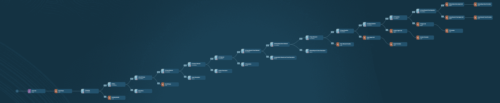
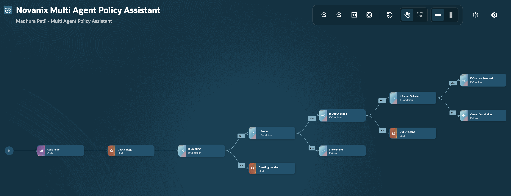
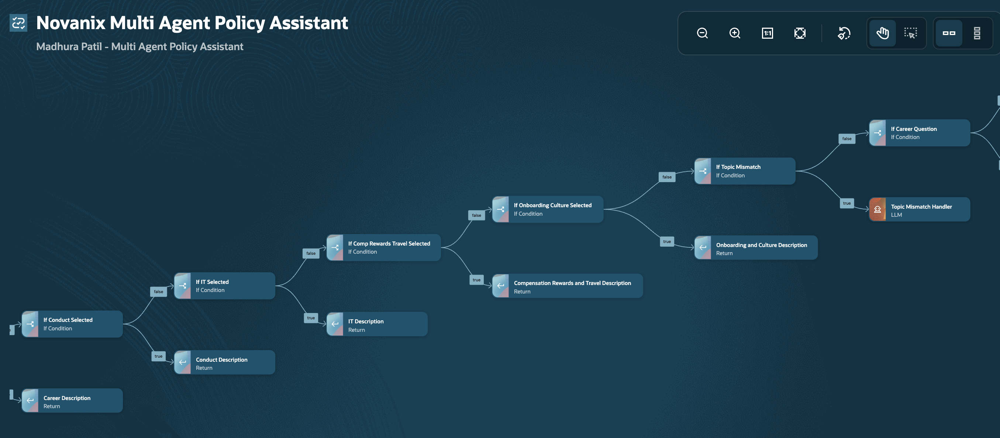
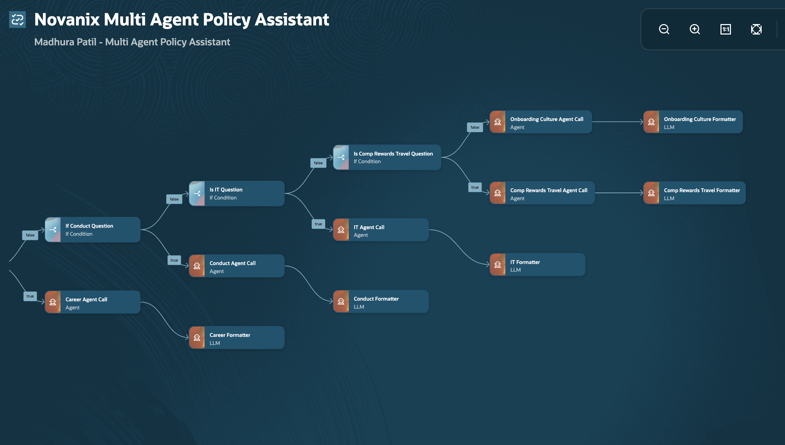
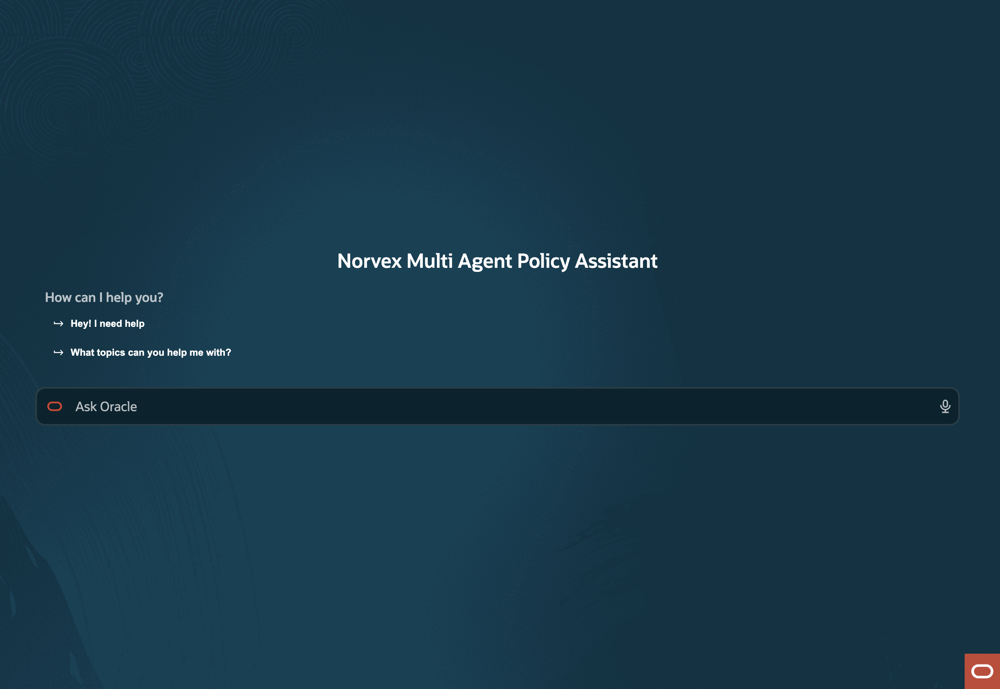
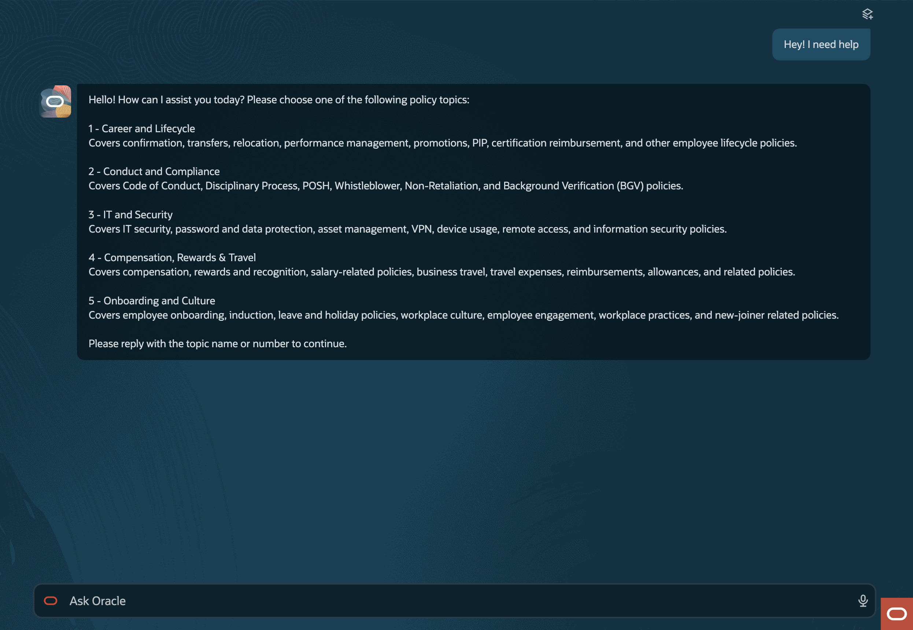
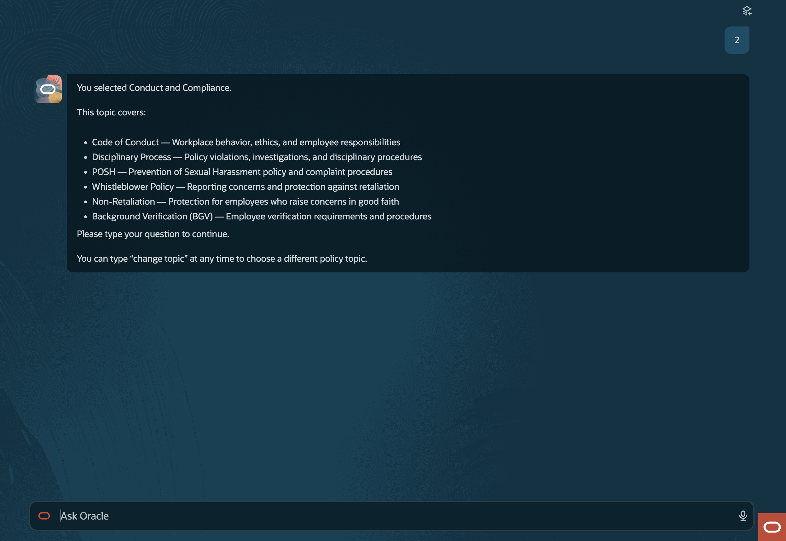
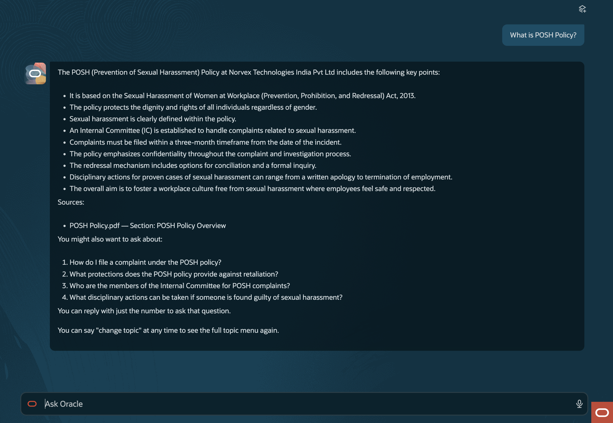
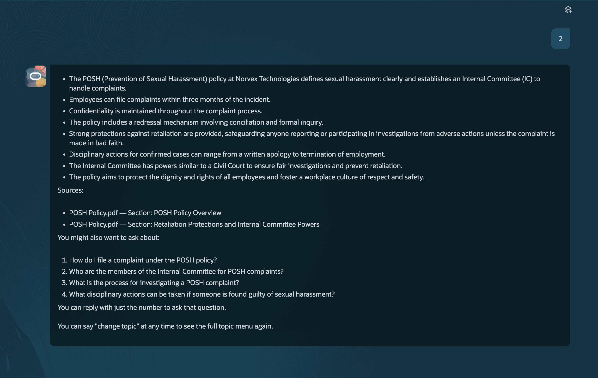
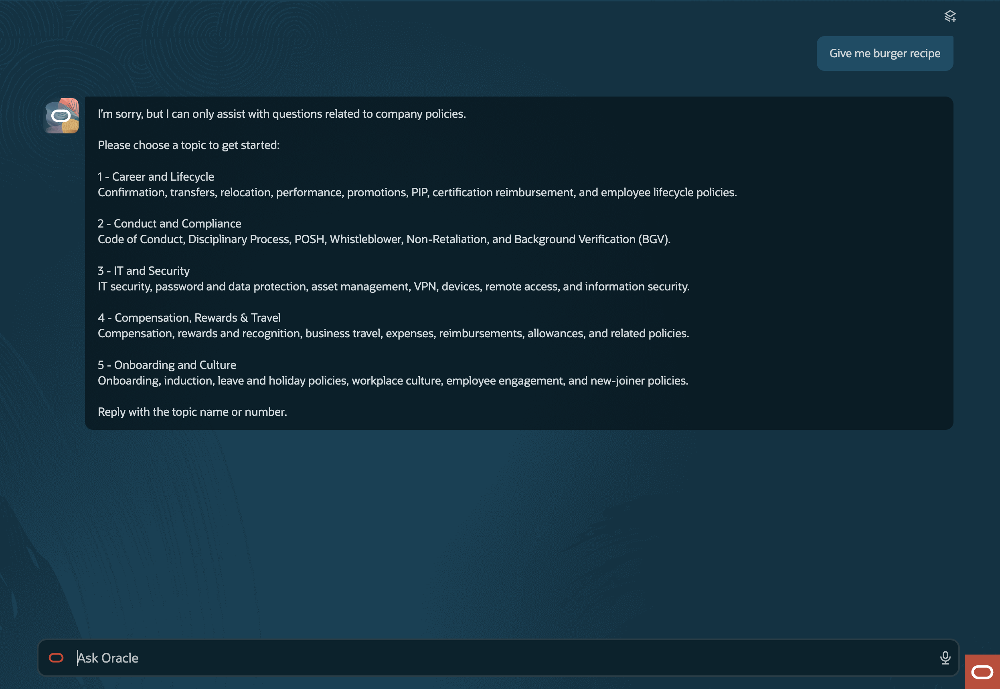

# Norvex Multi-Agent Policy Assistant

A conversational AI assistant built in **Oracle AI Agent Studio** that helps employees at
**Norvex Technologies** get answers to company policy questions.

Instead of one generic agent trying to know everything, it routes each conversation through a
**menu of five specialized topic areas**, each backed by its own AI agent and its own set of
policy documents.

---

## Problem Statement

> Companies deal with large volumes of internal documents — HR policies, product manuals,
> onboarding guides, SOPs — and employees waste time hunting for answers buried in PDFs.
> Build an AI assistant that lets users ask questions in plain English and get accurate,
> cited answers from a document library.

Company policies live as dozens of PDFs on an HRMS portal. An employee wondering *"How many days
do I have to submit a travel claim?"* has to guess which document applies, open a 40-page PDF,
`Ctrl+F` for the right clause, and interpret dense policy language alone — or raise an HR ticket.

A naive chatbot makes this worse: a confidently hallucinated policy answer is more damaging than
no answer, because employees act on it. The assistant has to be **verifiable**, not just fluent.

---

## Solution

| | |
|---|---|
| **Platform** | Oracle AI Agent Studio (Fusion HCM) |
| **Workflow** | `data_pipeline` — 36 nodes, 7 node types |
| **Agents** | 5 published `WORKER` agents |
| **Document tools** | 5 `DOCUMENT` tools, 18 policy PDFs |
| **Model** | `ORA_MODEL_CONFIG_PREMIUM_OPEN_AI_GPT_4_1_MINI` |
| **Status** | `PUBLISHED` (version 2) |

Five specialist agents, each bound to exactly one document tool, so an agent can only ever answer
from its own domain's policies:

| # | Agent | Document tool | Covers |
|---|---|---|---|
| 1 | `LIFECYCLE_CAREER_AGENT` | `DT_LIFECYCLE_CAREER` | Confirmation, transfer, relocation, PIP, appraisal & promotion |
| 2 | `CONDUCT_COMPLIANCE_AGENT` | `DT_CONDUCT_COMPLIANCE` | POSH, whistleblower, disciplinary, BGV |
| 3 | `IT_SECURITY_AGENT` | `DT_IT_SECURITY` | IT policies, HR security, remote connectivity & data protection |
| 4 | `COMPENSATION_REWARDS_AND_TRAVEL_AGENT` | `DT_COMP_REWARDS` | Rewards & recognition, certification reimbursement, travel |
| 5 | `ONBOARDING_AND_CULTURE_AGENT` | `DT_ONBOARDING_CULTURE` | Employee handbook, onboarding, referrals, communication |

Every agent is instructed to ground answers strictly in its attached documents, cite the exact
file name and section, say plainly when something isn't covered, and suggest 2–4 follow-up
questions within its own topic. All five return structured output:

```jsonc
{
  "answer": "string",
  "foundInDocuments": true,
  "isActiveIncident": false,
  "sources": [{ "fileName": "POSH Policy.pdf", "section": "Complaint Procedure" }],
  "followUpQuestions": ["...", "...", "..."]
}
```

---

## The Workflow

Every time the employee sends a message, the entire workflow runs once from start to end, using
the full conversation history to understand context.

```
                    ┌───────────┐
                    │   START   │
                    └─────┬─────┘
                          ▼
          ┌───────────────────────────────┐
          │          CODE_NODE            │  JavaScript — no AI
          │  • which topic is ACTIVE?     │  → activeTopic
          │  • is this a FRESH topic pick?│    isFreshSelection
          │  • menu-redisplay reset       │    selectedTopic
          └───────────────┬───────────────┘
                          ▼
          ┌───────────────────────────────┐
          │         CHECK_STAGE           │  LLM classifier
          │  treats CODE_NODE output as   │  → 14 boolean flags
          │  fixed, external truth        │    (exactly ONE true)
          │  never answers the question   │    + resolvedQuestion
          └───────────────┬───────────────┘
                          ▼
       ╔══════════════════════════════════════════╗
       ║     13 CONDITION NODES, IN CASCADE       ║
       ║   each tests one flag; false → next      ║
       ╚══════════════════════════════════════════╝
             │              │                │
             ▼              ▼                ▼
      ┌────────────┐  ┌───────────┐  ┌──────────────────┐
      │ LLM nodes  │  │  RETURN   │  │   AGENT  (×5)    │
      │            │  │  static   │  │         ↓        │
      │ greeting   │  │  text     │  │  FORMATTER (×5)  │
      │ out-of-    │  │           │  │  • format answer │
      │  scope     │  │ menu +    │  │  • Sources block │
      │ topic      │  │ 5 topic   │  │  • numbered f/ups│
      │  mismatch  │  │ descrip-  │  │  • hidden marker │
      │            │  │ tions     │  │                  │
      └─────┬──────┘  └─────┬─────┘  └────────┬─────────┘
            └───────────────┴─────────────────┘
                            ▼
                      ┌───────────┐
                      │    END    │
                      └───────────┘
```

### Step 1 — Code Node *(deterministic, no AI)*

Before any AI reasoning, a JavaScript node scans the raw conversation history to determine two
things with total reliability: **which topic is currently active**, and **whether this message is
a fresh topic pick from the menu**.

It finds the last `You selected …` line and the last menu display, then applies one rule:

```js
if (lastSelectedIndex > lastMenuIndex) { /* a topic is active */ }
```

If the menu was shown *after* the last selection, the topic resets to `NONE`. That single
comparison is the entire "change topic" reset mechanism — no state store, just relative position
in the transcript. A fresh selection is then matched against exact allow-lists
(`1`, `it`, `it & security`, …), but **only when no topic is already active** — which is what
stops a bare `3` from being read as a topic switch when the user meant "follow-up question 3".

**Why code and not AI:** purely AI-based classification struggled to consistently track which
topic was active across a long, growing conversation. As history grows, a model's attention to
*"which menu item did the user pick eleven turns ago"* degrades — and the failure is silent,
because the wrong specialist still produces a fluent-sounding answer. Exact text matching is 100%
consistent on turn 2 and on turn 40 alike.

The design bet: **use code for state, use AI for language.**

### Step 2 — Check Stage *(AI classifier)*

An LLM node takes the Code node's output **as fixed truth** and classifies the turn into exactly
one of fourteen outcomes. It never answers the question — it only decides what kind of turn this
is and extracts the question text to hand off.

Its **Rule Zero** is explicit:

> Treat this activeTopic value as fixed, external truth. Do not derive it yourself from
> conversation history, do not question it, do not override it, and do not change it under any
> circumstance, **even if it seems to contradict what you would have concluded on your own.**

Precedence order, stopping at the first match:

| # | Check | Notes |
|---|---|---|
| 1 | **Greeting** | `hi`, `hello`, `thanks` — always wins |
| 2 | **Change topic** | Judged by intent: `switch topic`, `go back`, `main menu`, `reset` |
| 3 | **Follow-up number** | Only when a topic is active and input is exactly `1`–`5` |
| 4 | **Normal question** | Out of scope → no topic match · matches active topic → agent · differs → mismatch |

### Step 3 — Routing

Thirteen condition nodes, **chained** — each one's `false` outcome points at the next test.
Because the classifier guarantees exactly one flag is true, the cascade is a plain if-else chain;
all the precedence logic lives in the prompt, and the graph just walks the list.

### Step 4 — Agent Call

The matching specialist receives `resolvedQuestion`, searches its own documents, and either
answers with citations or reports `foundInDocuments: false` and directs the employee to HR, the
Ethics helpline, or the IT helpdesk as appropriate for that domain.

**Live incident escalation.** The Conduct and IT agents detect when a message describes a real,
ongoing incident rather than a general policy question — harassment or retaliation for Conduct,
phishing or a lost device for IT. They skip the normal answer, provide official reporting steps
immediately, and **suppress follow-up questions entirely**, since an active incident response
should not invite casual browsing.

### Step 5 — Formatter

One per agent branch. Takes the raw answer and prepares the final reply in five steps: format the
answer to suit the content (numbered list for procedures, table for comparisons, bullets for
independent facts, paragraph for a single fact), add the `Sources:` block, list the follow-up
questions numbered from 1, add the *"change topic"* closing line, and append the hidden marker.

### The follow-up mechanism

The formatter embeds the follow-up list as a hidden marker at the very end of its reply —
invisible when read, present in the raw text:

```html
<!--FOLLOWUPJSON[{"n":1,"question":"What is the disciplinary process?"}]FOLLOWUPJSON-->
```

If the next message is a bare number, `CHECK_STAGE` reads the marker from **only the single most
recent assistant turn**, resolves the number to the full question text, and sends that to the
agent — never the bare digit, which would retrieve nothing. If the marker is missing or no number
matches, it falls back to the menu rather than guessing from an older list.

---

## Node Reference

**36 nodes across 7 types:** `START` ×1 · `CODE` ×1 · `LLM` ×9 · `CONDITION` ×13 · `RETURN` ×6 ·
`AGENT` ×5 · `END` ×1

| Node | Type | What it does |
|---|---|---|
| `START` | `START` | Pipeline entry point |
| `CODE_NODE` | `CODE` | JavaScript — extracts active topic and fresh-selection state from history |
| `CHECK_STAGE` | `LLM` | Classifies the turn into 14 flags, exactly one true; extracts `resolvedQuestion` |
| `IF_GREETING` | `CONDITION` | Is this a greeting? |
| `GREETING_HANDLER` | `LLM` | Friendly welcome plus the five-topic menu |
| `IF_MENU` | `CONDITION` | Is this a change-topic request? |
| `SHOW_MENU` | `RETURN` | Emits the static topic menu |
| `IF_OUT_OF_SCOPE` | `CONDITION` | Is this a non-policy question? |
| `OUT_OF_SCOPE` | `LLM` | Polite redirect back to the menu |
| `IF_CAREER_SELECTED` | `CONDITION` | Topic 1 picked? |
| `CAREER_DESCRIPTION` | `RETURN` | Confirms topic 1 and lists its scope |
| `IF_CONDUCT_SELECTED` | `CONDITION` | Topic 2 picked? |
| `CONDUCT_DESCRIPTION` | `RETURN` | Confirms topic 2 and lists its scope |
| `IF_IT_SELECTED` | `CONDITION` | Topic 3 picked? |
| `IT_DESCRIPTION` | `RETURN` | Confirms topic 3 and lists its scope |
| `IF_COMP_REWARDS_TRAVEL_SELECTED` | `CONDITION` | Topic 4 picked? |
| `COMPENSATION_REWARDS_AND_TRAVEL_DESCRIPTION` | `RETURN` | Confirms topic 4 and lists its scope |
| `IF_ONBOARDING_CULTURE_SELECTED` | `CONDITION` | Topic 5 picked? |
| `ONBOARDING_AND_CULTURE_DESCRIPTION` | `RETURN` | Confirms topic 5 and lists its scope |
| `IF_TOPIC_MISMATCH` | `CONDITION` | Does the question belong to a different topic? |
| `TOPIC_MISMATCH_HANDLER` | `LLM` | Reminds the user what the current topic covers, offers "change topic" |
| `IF_CAREER_QUESTION` | `CONDITION` | On-topic career question? |
| `CAREER_AGENT_CALL` | `AGENT` | Invokes `LIFECYCLE_CAREER_AGENT` |
| `CAREER_FORMATTER` | `LLM` | Formats the career answer for display |
| `IF_CONDUCT_QUESTION` | `CONDITION` | On-topic conduct question? |
| `CONDUCT_AGENT_CALL` | `AGENT` | Invokes `CONDUCT_COMPLIANCE_AGENT` |
| `CONDUCT_FORMATTER` | `LLM` | Formats the conduct answer for display |
| `IS_IT_QUESTION` | `CONDITION` | On-topic IT question? |
| `IT_AGENT_CALL` | `AGENT` | Invokes `IT_SECURITY_AGENT` |
| `IT_FORMATTER` | `LLM` | Formats the IT answer for display |
| `IS_COMP_REWARDS_TRAVEL_QUESTION` | `CONDITION` | On-topic compensation/travel question? |
| `COMP_REWARDS_TRAVEL_AGENT_CALL` | `AGENT` | Invokes `COMPENSATION_REWARDS_AND_TRAVEL_AGENT` |
| `COMP_REWARDS_TRAVEL_FORMATTER` | `LLM` | Formats the compensation/travel answer |
| `ONBOARDING_CULTURE_AGENT_CALL` | `AGENT` | Invokes `ONBOARDING_AND_CULTURE_AGENT` (fall-through branch) |
| `ONBOARDING_CULTURE_FORMATTER` | `LLM` | Formats the onboarding answer for display |
| `END` | `END` | Pipeline exit point — all branches converge here |

**Why `RETURN` nodes:** the menu and the five topic descriptions are fixed text that never varies,
so they are emitted verbatim rather than generated by a model. Faster, free, and the wording stays
identical every time — which matters, because `CODE_NODE` pattern-matches against exactly this
text.

---

## Document Tools

Five `DOCUMENT`-type tools, each attached to exactly one agent. Oracle AI Agent Studio handles
parsing, chunking, embedding, and semantic retrieval — no external vector database or custom code.

### `DT_LIFECYCLE_CAREER`
> Employee lifecycle and career policies — confirmation, transfers, relocation, performance
> improvement plans, appraisals, promotions, and career progression.

### `DT_CONDUCT_COMPLIANCE`
> Employee conduct, workplace compliance, ethics, disciplinary procedures, POSH-related matters,
> whistleblower protection, non-retaliation, and background verification.

### `DT_IT_SECURITY`
> IT, information security, HR security, remote-access, connectivity, data protection, and
> technology usage policies.

### `DT_COMP_REWARDS`
> Rewards, recognition programs, certification reimbursement, business travel, travel eligibility,
> expenses, and related reimbursement policies.

### `DT_ONBOARDING_CULTURE`
> Employee onboarding, general employee guidelines, workplace culture, referral programs, internal
> communication, and the employee handbook.

---

## Documents Uploaded

**18 policy PDFs**, downloaded from the HRMS portal and uploaded into the five document tools.

| Document Tool | Documents |
|---|---|
| `DT_LIFECYCLE_CAREER` | `Confirmation Policy.pdf`<br>`Transfer Policy.pdf`<br>`India Relocation Policy.pdf`<br>`PIP Process.pdf`<br>`Performance Appraisal and Promotion Policy.pdf` |
| `DT_CONDUCT_COMPLIANCE` | `POSH Policy.pdf`<br>`Whistleblower and Non Retaliation Policy.pdf`<br>`Disciplinary Policy.pdf`<br>`BGV Policy.pdf` |
| `DT_IT_SECURITY` | `All IT Policies.pdf`<br>`HR Security Policy.pdf`<br>`Remote Connectivity and Data Protection Policy.pdf` |
| `DT_COMP_REWARDS` | `Rewards and Recognition Policy.pdf`<br>`Certification Reimbursement Policy.pdf`<br>`Travel Policy.pdf` |
| `DT_ONBOARDING_CULTURE` | `Norvex India Employee Handbook.pdf`<br>`Norvex Crew  Employee Referral Policy.pdf`<br>`Communication Policy.pdf` |

The one-agent-to-one-tool pairing is what makes *"answer only from your own documents"* an
enforceable constraint rather than an aspiration — an agent physically cannot retrieve another
domain's policy.

---

## Screenshots

### Workflow design

**Full workflow canvas** — all 36 nodes as a single diagonal cascade, from the Code node through the condition chain to the five agent-and-formatter pairs.



**Start of the pipeline** — `code node` → `Check Stage` → `If Greeting` → `If Menu` → `If Out Of Scope`, with the greeting and menu branches peeling off.



**Topic-selection branches** — the five `If … Selected` conditions, each with its `Return` description node, ending at `If Topic Mismatch`.



**Question routing** — the `Is … Question` conditions fanning out to the five `Agent Call` nodes, each feeding its own `Formatter`.



### Working demo

**Chat landing screen** — the assistant opens with its two starter questions.



**Greeting → topic menu** — *"Hey! I need help"* is classified as a greeting, and the five policy topics are presented.



**Topic selected** — typing `2` locks the conversation to Conduct and Compliance and lists exactly what that topic covers.



**Cited answer with follow-ups** — *"What is POSH Policy?"* is answered from `POSH Policy.pdf`, cited down to the section, with four numbered follow-up questions.



**Follow-up by number** — replying `2` resolves to the retaliation-protections question and answers it, this time citing two separate sections.



**Out-of-scope handling** — *"Give me burger recipe"* is declined politely and the user is returned to the topic menu.


